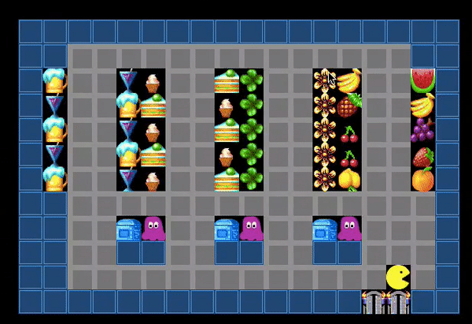
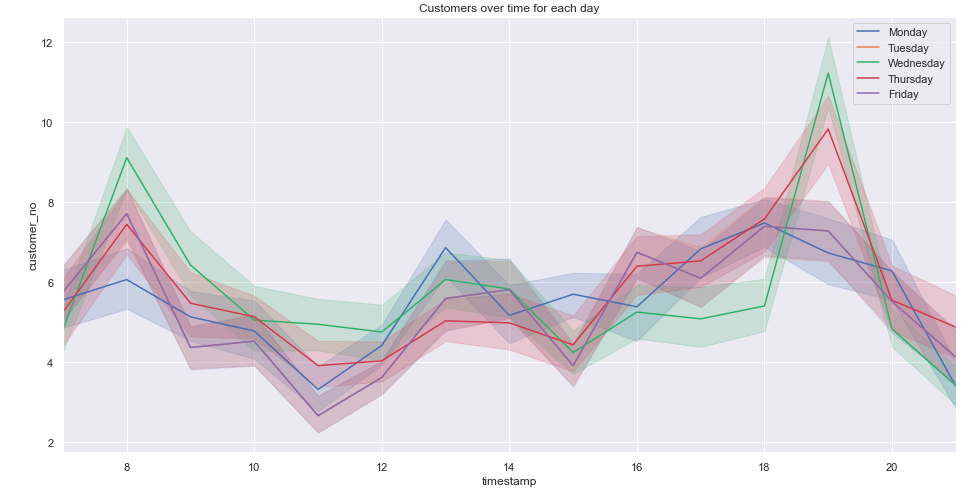

## Supermarket Simulation 
This program simulates the path a customer takes when entering a supermarket, based on a Monte Carlo Markov Chain simulation and A* path finding algorithm. 

### How is this simulation working? 
1. Based on the Monday data, a transition probability matrix is calculated: this allows us to know once the customer enters the supermarket, what are the probabiltiy that they will go to a station ('dairy', 'drinks', 'fruit', 'spices', and 'checkout') and once they are at a station, the probabilities that they move to another station. 
2. From this Matrix, a simulation path is calculated based on Monte Carlo Markov Chains, for example: 'drinks, fruit, fruit, spices, dairy, dairy, dairy, dairy, dairy, dairy, dairy, dairy, spices, fruit, checkout'
3. From this path, the coordinate path is calculated using A* algorithm, knowing the coordinates of each station, and that our customers will move in steps of one either up, down, left or right, for example: [[(4, 7), (5, 7), (6, 7), (7, 7), (7, 8), (7, 9), (7, 10), (8, 10), (8, 11)]]
4. Finally, the customer is visualized on a customized supermarket map and is moved depending on the coordinates path previously calculated. 

### Scripts:
- EDA.ipynb: Analysis of the Data, answering business related questions with visualisations

- MCMC_Apath.ipynb: Calculations to get the final coordinate path
- simulation_pop_one.py: Visualisation using OpenCV for one customer in the Supermarket

### Usage: 
- Create a virtual environement with python 3.8 (optional): conda create -n py38 python=3.8 
- Activat the virtual environment (optional): conda activate py38
- Clone the repository
- Install requirements: pip install -r requirements.txt
- to run: python simulation_pop_one.py

### Keywords:
OpenCV, Numpy, Monte-Carlo, Markov Chain, pandas

### Next steps: 
- Implement the visualisation for all the paths calculated (see paths.txt)
- Testing
- Incorporate all the days of the week, not just Monday in the simulation

This is a cooperation between [Marina Meiners](https://github.com/MarinaMeiners), [Nevena](https://github.com/nevezi), [Ben](https://github.com/NOTpilatus), and [Aurelie Ferron](https://github.com/ferrau10) during our Spiced Academy Data Science Bootcamp.

